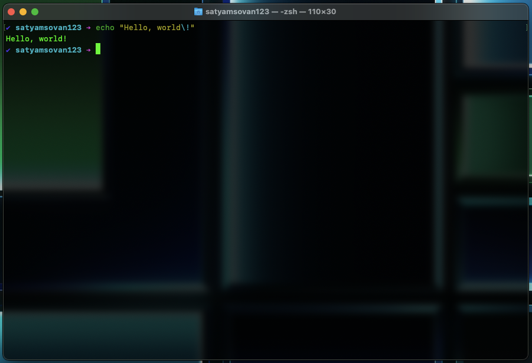

# zshrc-config

This repository contains the zsh config and required files for setting up my computers. It overrides some of the default terminal features that macOS ships with.

# Installation (sort of)

Open _.zshrc_ file (there is a dot prefixed, and file hidden by default) and change the <code>\$USERNAME</code> variable to your **userName** or just delete the variable and replace the <code>\$USERNAME</code> strings all together with your **userName** (e.g. replace <code>\$USERNAME</code> with satyamsovan123).

Copy _.zsh-config_ folder (there is a dot prefixed, and folder is hidden by default) to _/Users/userName_ folder (your home directory, e.g. copy to /Users/satyamsovan123).
To get the anti-aliased fonts and   even cleaner terminal experience, you can use _Homebrew.terminal_ file inside _.zsh-config_ folder. It has a translucent blurry background with an added black tint and it enhances the reading experience too by changing the font style and size. You can double click on _Homebrew.terminal_ file and make it default to use it.
It also has auto completion features, syntax highlighting. If you have Angular installed, you can uncomment the <code>source <(ng completion script)</code> line in _.zshrc_ file, which will give you auto completion for Angular CLI. For further customization, I suggest checking out [zsh-syntax-highlighting](https://github.com/zsh-users/zsh-syntax-highlighting) and 
[zsh-autocomplete](https://github.com/marlonrichert/zsh-autocomplete).

 

**P.S. This can be used for macOS or any Linux/Unix based system with zsh installed.**

# Customize to your heart's content 🖌️

A sample picture is added for reference

